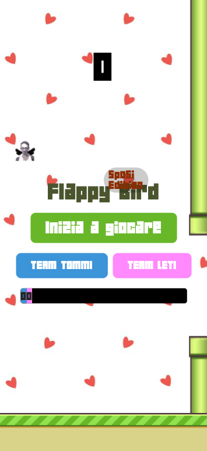

# FlippyBird
[](https://app.netlify.com/sites/flippibird/deploys)

FlippyBird is a fun game inspired by Flappy Bird, created for a wedding celebration. It's built using Expo and React Native, allowing it to run smoothly on both iOS and Android devices, as well as web browsers.

## Features

- Easy to play, challenging to master gameplay.
- Online scoring, with teams
- Customize the game's setting and objects by replacing the files in the `sprites` folder.
- Realtime database integration using Firebase Realtime Database for storing player scores.
- Option to use a local Firebase configuration file (`firebase_conf.js`) for local development or a file (`firebase.js`) for a backend server for production.
## Installation

To get started with FlippyBird, follow these steps:

1. Clone this repository to your local machine:

   ```bash
   git clone https://github.com/davidebassan/Flippi-Bird.git
   ```
2. Navigate to the project directory
  
   ```bash
   cd Flippy-Bird
   ```
3. Install dependencies using npm or yarn:

   ```bash
   npm install
   # or
   yarn install
   ```

## Running the Game

### Local Development
For local development, follow these steps:

1. Make sure you have Node.js and Expo CLI installed on your machine.

2. Create a Firebase project and set up Firebase Realtime Database.

3. Copy the Firebase configuration from your Firebase console into the a file named .env, at the root folder ```/``` of the project, and fill it such as.

   ```bash 
    EXPO_PUBLIC_FIREBASE_API_KEY=
    EXPO_PUBLIC_FIREBASE_AUTH_DOMAIN=
    EXPO_PUBLIC_FIREBASE_DATABASE_URL=
    EXPO_PUBLIC_FIREBASE_PROJECT_ID=
    EXPO_PUBLIC_FIREBASE_STORAGE_BUCKET=
    EXPO_PUBLIC_FIREBASE_MESSAGING_SENDER_ID=
    EXPO_PUBLIC_FIREBASE_APP_ID=
    EXPO_PUBLIC_FIREBASE_MEASUREMENT_ID=
   ```

4. Rename ```firebase_conf.js``` to ```firebase.js```.

5. Build and run
   ```bash
   follow the instruction from Expo
   ```

### Production Development
In order to avoid sharing of API Keys, use firebase.js, and create a backend that can manage those requests.

**Server example:**
```bash
const express = require('express');
const cors = require('cors');
const { savePlayerScore, aggregateScoresByPlayerType } = require('./firebaseController');

const app = express();
const port = process.env.PORT || 3000;

app.use(cors());
app.use(express.json());

app.post('/scores', async (req, res) => {
  const { score, playerType } = req.body;
  try {
    await savePlayerScore(score, playerType);
    return res.status(201).json({ message: 'Score salvato con successo.' });
  } catch (error) {
    console.error('Errore durante il salvataggio dello score:', error);
    return res.status(500).json({ error: 'Internal server error' });
  }
});

app.get('/scores/:playerType', async (req, res) => {
  const playerType = req.params.playerType;
  try {
    const totalScore = await aggregateScoresByPlayerType(playerType);
    return res.status(200).json({ totalScore });
  } catch (error) {
    console.error('Errore durante il recupero dei punteggi:', error);
    return res.status(500).json({ error: 'Internal server error' });
  }
});

app.listen(port, () => {
  console.log(`Server is running on http://localhost:${port}`);
});
```

## Customization
You can customize the game's settings and objects by replacing the files in the ```sprites``` folder. Feel free to modify the game to fit your preferences and theme!

## Screenshot

